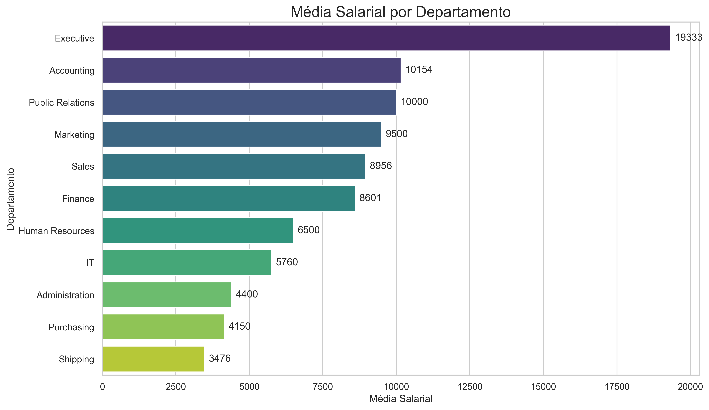
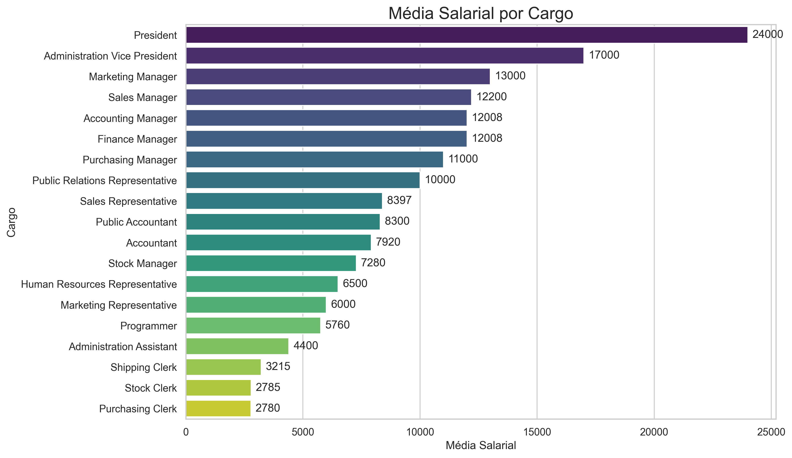
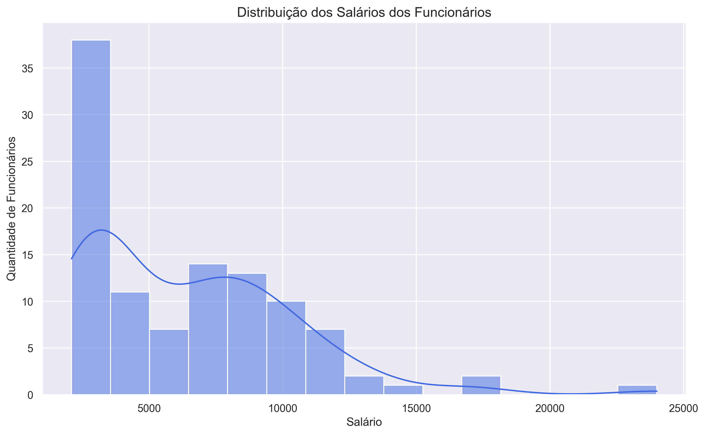
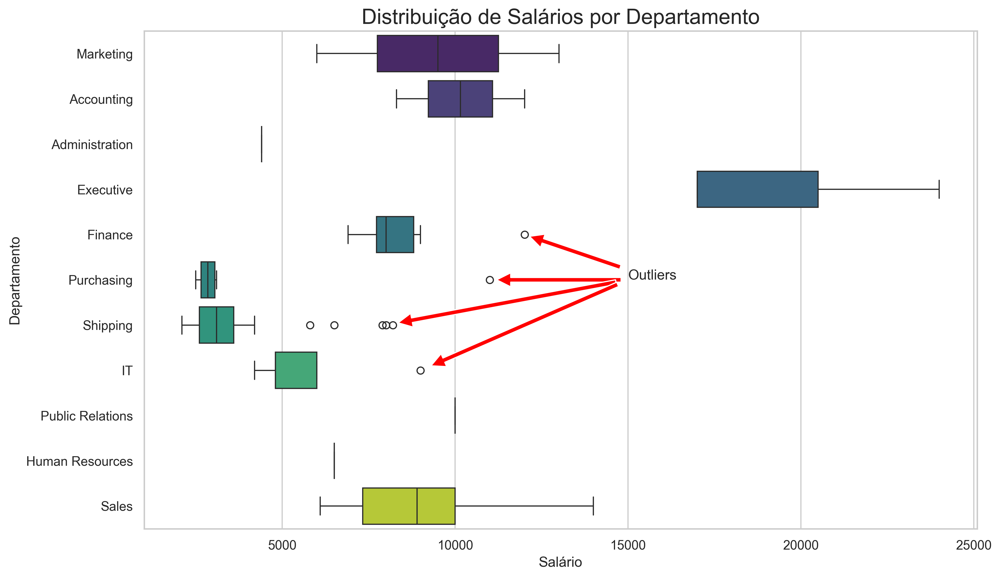
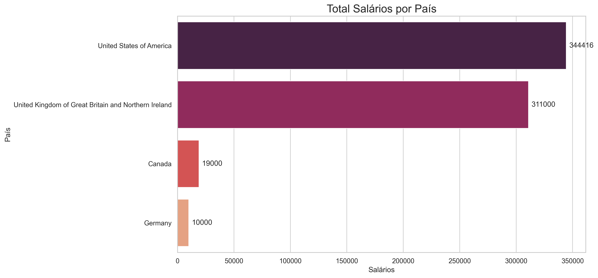
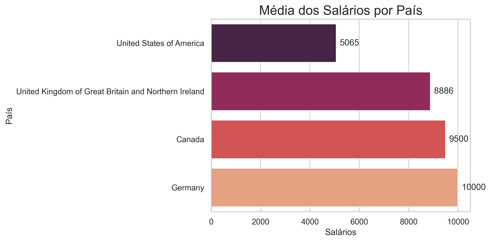

# SCTEC - Modulo I - Projeto Final

## Projeto Avaliativo - Módulo I - Visualização de Dados e Business Intelligence [T2]

**Aluno: ORLANDO VIEIRA DE CASTRO JUNIOR
Turma: Visualização de Dados e Business Intelligence [T2]**

## Objetivo do trabalho

Este projeto tem como objetivo analisar dados de Recursos Humanos utilizando o banco de dados [FreeSQL](https://freesql.com/), no esquema **Human Resources (HR)**, explorando informações sobre funcionários, cargos, departamentos, salários e localização geográfica.

A partir dessas informações, foram realizadas consultas SQL e uma análise exploratória em Python para entender a distribuição de salários por departamento e cargo, bem como a distribuição dos funcionários por região, apoiando decisões simples de gestão e visualização de dados.

## Checklist de etapas do projeto

- [x] Acessar o ambiente FreeSQL e localizar o esquema **HR (Human Resources)**.
- [x] Selecionar as tabelas necessárias: EMPLOYEES, DEPARTMENTS, JOBS, LOCATIONS, COUNTRIES e REGIONS.
- [x] Implementar a Query 1 (salários por departamento e cargo) com pelo menos dois `LEFT JOIN` e um `WHERE` simples.
- [x] Implementar a Query 2 (funcionários por região) com pelo menos dois `LEFT JOIN` e um `WHERE` simples.
- [x] Executar as queries e validar os resultados no FreeSQL.
- [x] Exportar os resultados das queries para arquivos CSV (`salarios_por_depto_cargo.csv` e `funcionarios_por_regiao.csv`).
- [x] Salvar os códigos SQL em `Query_1.sql` e `Query_2.sql` no repositório.
- [x] Importar os arquivos CSV no Python (VS Code ou Jupyter Notebook) e realizar a EDA.
- [x] Importar os arquivos CSV no Python (VS Code ou Jupyter Notebook) e realizar a EDA.
- [x] Calcular estatísticas básicas (média, mediana, mínimo, máximo) para os salários. 
- [x] Criar pelo menos um histograma ou boxplot para visualizar a distribuição dos salários.
- [x] Importar os arquivos CSV no Python (VS Code ou Jupyter Notebook) e realizar a EDA.
- [x] Calcular estatísticas básicas (média, mediana, mínimo, máximo) para os salários.
- [x] Criar pelo menos um histograma ou boxplot para visualizar a distribuição dos salários.
- [x] Atualizar o `README.md` com objetivo, tabelas usadas, resumo das queries e principais resultados.
- [x] Importar os arquivos CSV no Python (VS Code ou Jupyter Notebook) e realizar a EDA.
- [x] Importar os arquivos CSV no Python (VS Code ou Jupyter Notebook) e realizar a EDA.
- [x] Calcular estatísticas básicas (média, mediana, mínimo, máximo) para os salários.
- [x] Criar pelo menos um histograma ou boxplot para visualizar a distribuição dos salários.
- [x] Importar os arquivos CSV no Python (VS Code ou Jupyter Notebook) e realizar a EDA.
- [x] Calcular estatísticas básicas (média, mediana, mínimo, máximo) para os salários.
- [x] Criar pelo menos um histograma ou boxplot para visualizar a distribuição dos salários.
- [x] Atualizar o `README.md` com objetivo, tabelas usadas, resumo das queries e principais resultados.
- [x] Gravar o vídeo de apresentação técnica e incluir o link conforme orientações da atividade.

## Tabelas utilizadas

Para construir as consultas e gerar os arquivos CSV utilizados na análise, foram usadas as seguintes tabelas do esquema **HR**:

- **HR.EMPLOYEES**: contém os dados dos funcionários, como identificador (`EMPLOYEE_ID`), nome, cargo (`JOB_ID`), salário (`SALARY`) e departamento (`DEPARTMENT_ID`).
- **HR.DEPARTMENTS**: armazena os departamentos da empresa, com código (`DEPARTMENT_ID`), nome do departamento (`DEPARTMENT_NAME`) e local onde o departamento está instalado (`LOCATION_ID`).
- **HR.JOBS**: reúne os cargos disponíveis, incluindo código do cargo (`JOB_ID`), título (`JOB_TITLE`), salário mínimo (`MIN_SALARY`) e salário máximo (`MAX_SALARY`) associados a cada função.  
- **HR.LOCATIONS**: guarda informações de localização física, como cidade (`CITY`), estado ou província (`STATE_PROVINCE`), endereço e país (`COUNTRY_ID`).
- **HR.COUNTRIES**: lista os países, relacionando cada país a uma região através de `REGION_ID`.
- **HR.REGIONS**: define as regiões (por exemplo, Europa, Américas, Ásia), utilizadas para agrupar países e facilitar a análise geográfica.

## Resumo das consultas SQL

**Query 1 – Salários por departamento e cargo**

A [Query_1.sql](dados/Query_1.sql) relaciona as tabelas `HR.EMPLOYEES`, `HR.DEPARTMENTS` e `HR.JOBS` por meio de `LEFT JOIN`, trazendo, para cada funcionário, o departamento em que atua, o cargo ocupado e o respectivo salário. 

Com isso, é possível analisar a distribuição de salários por departamento e cargo, comparar faixas salariais entre setores e verificar se o salário do funcionário está dentro do intervalo mínimo e máximo definido para o seu cargo.

Os dados obtidos por meio dessa consulta foram exportados para o arquivo [salarios_por_depto_cargo.csv](dados/salarios_por_depto_cargo.csv) que contém os dados de salários por departamento e cargo.

**Query 2 – Funcionários por região (com localização)**

A [Query_2.sql](dados/Query_2.sql) amplia a análise incluindo as tabelas `HR.LOCATIONS`, `HR.COUNTRIES` e `HR.REGIONS`, além de `HR.EMPLOYEES` e `HR.DEPARTMENTS`, também utilizando `LEFT JOIN`.

Essa consulta permite observar, para cada funcionário, o departamento, a cidade, o estado/província, o país e a região em que está localizado, possibilitando análises de salários e distribuição geográfica por região, país e cidade.

Os dados obtidos por meio dessa consulta foram exportados para o arquivo [funcionarios_por_regiao.csv](dados/funcionarios_por_regiao.csv) que contém os dados de funcionários por região, incluindo informações de localização.

**Tanto as consultas SQL feitas na base de dados [FreeSQL](https://freesql.com/), como os arquivos exportados para .CSV se encontram na pasta [dados](dados) deste repositório.**

## Análise exploratória em Python

A análise exploratória em Python consistiu das seguintes etapas:

1. Importação das bibliotecas necessárias (`pandas`, `numpy`, `matplotlib`, `duckdb`e `seaborn`). Caso necessário, as bibliotecas devem ser instaladas com o comando `pip install pandas numpy matplotlib duckdb seaborn`.

2. Importação dos dados das planilhas `funcionarios_por_regiao.csv` e `salarios_por_depto_cargo.csv` previamente obtidas por meio de consultas SQL feitas no banco `FreeSQL` ;

3. Os dados foram importados em tabelas `duckdb` tornando possível novas consultas e filtros usando SQL;

4. Foram realizadas as seguintes análises estatísticas e visualizações gráficas para os dados de **salários por cargos e departamentos**: 
   
   4.1. Distribuição dos salários por departamento;
   
   4.2. Distribuição dos salários por cargo;
   
   4.3. Histograma da distribuição dos salários;
   
   4.4. Média salarial por departamento;
   
   4.5. Boxblot da distribuição dos salários por departamento;
   
   4.6. Média salarial por cargo;
   
   4.7. Boxplot da distribuição dos salários por cargo;

5. Foram realizadas as seguintes análises estatísticas e visualizações gráficas para os dados de **funcionários de salários por localização geográfica**:
   
   5.1. Distribuição de funcionários por país;
   
   5.2. Distribuição dos cargos por país;
   
   5.3. Distribuição dos salários por país;
   
   5.4. Salários médios por país;
   
   5.5. Boxplot da distribuição dos salários por país;

## Principais resultados encontrados

1. Disparidade salarial por setor:
   
   * Os dados indicam que a faixa salarial para os cargos da empresa é ampla e varia de 2.008,00 (menor valor de `MIN_SALARY`) a 40.000,00 (maior valor de `MAX_SALARY`).
   * O setor Executive destaca-se com a maior média salarial (19.333,33), enquanto Shipping e Administration concentram as médias mais baixas (3.475,56 e 4.400,00, respectivamente).
   
   

   

     
   

   

   
   * O setor de Vendas (Sales) tem um alto volume de funcionários e um total de salários elevado (304.500,00), mas uma média salarial menor que a do setor de Executive, evidenciando uma pirâmide organizacional clássica. Os cargos executivos de presidente e vice presidente de administração são os mais bem remunerados na estrutura da empresa.
   
   

   

     
   

   

2. Distribuição salarial e outliers:
   
   * A distribuição dos salários, visualizada pelo histograma, mostra uma concentração nas faixas mais baixas, com uma cauda longa à direita.
   
   

   

     
   

   

   
   * O boxplot revelou a presença de outliers em departamentos como Finance, IT e Shipping. Isso sugere cargos de alta especialização ou tempo de empresa que podem destoar da folha de pagamento padrão desses setores.
   
   

   

     
   

   

3. Concentração geográfica:
   
   * A vasta maioria dos funcionários está alocada nos Estados Unidos, dessa forma, o maior valor total em salários pagos pertence a esse pais.
     
     

     

       
     

     

* A análise da média dos salários por países permite observar uma diferenciação salarial por localização. Em países como Alemanha, Canadá e Reino Unido, a empresa possui funcionários contratados em posições estratégicas nas áreas de marketing, vendas e relações públicas. Trata-se de um número reduzido de funcionários, mas que possuem salários diferenciados fazendo com que a média salárial nesses países seja maior.
  
  

  

    
  

  

## 

## Apresentação em vídeo

Em complemento às análises, foi criada uma apresentação técnica em vídeo que está disponível em:  https://youtu.be/G76IkJKUwlU

## Considerações finais e melhorias futuras

A presente análise exploratória de dados proporcionou uma visão ampla da distribuição geográfica da força de trabalho bem como dos salários por cargos, departamentos e países onde a empresa atua.

Como sugestões de melhorias, poderiam ser realizadas análises comparativas relacionadas ao tempo de empresa dos funcionários e os salários, aprofundar a investigação dos outliers de modo a identificar suas causas (funcionários mais antigos? cargos mais importantes na estrutura da empresa?).
